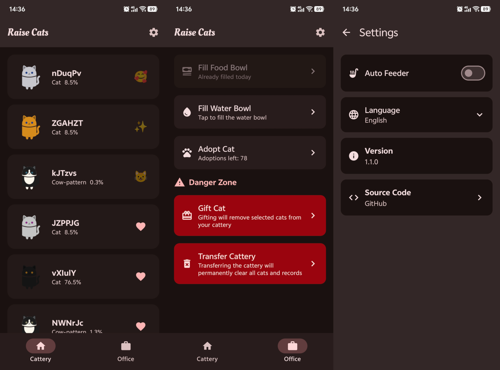

# Raise Cats

一个基于Android Compose的猫咪饲养应用，让你可以收养、照顾虚拟猫咪，管理你的专属猫舍。

## 功能特点

- 收养各种品种的猫咪，包括橘猫、布偶猫、暹罗猫等
- 照顾猫咪的日常需求，如喂食和换水
- 与猫咪互动，提升亲密度
- 自定义猫咪名字
- 支持中英文双语切换
- 自动喂养器功能，可自动照顾猫咪
- 查看猫咪的详细信息和概率数据

## 使用指南

1. **收养猫咪**: 在猫舍页面点击"收养猫咪"按钮，系统会随机生成一只猫咪
2. **照顾猫咪**: 点击"填满猫粮碗"和"填满水盆"按钮来照顾你的猫咪
3. **互动**: 点击猫咪卡片按钮与猫咪互动
4. **设置**: 可在设置页面切换语言、开启/关闭自动喂养器等
5. **编辑名字**: 点击猫咪名字可以编辑猫咪的名字

## 版本历史

- v1.1.0: 初始版本，包含基本的猫咪收养和管理功能

## 开源许可

本项目采用GPL v3许可证开源，详情参见LICENSE文件。

## 开发者

- [KaiZhou554](https://github.com/KaiZhou554)
